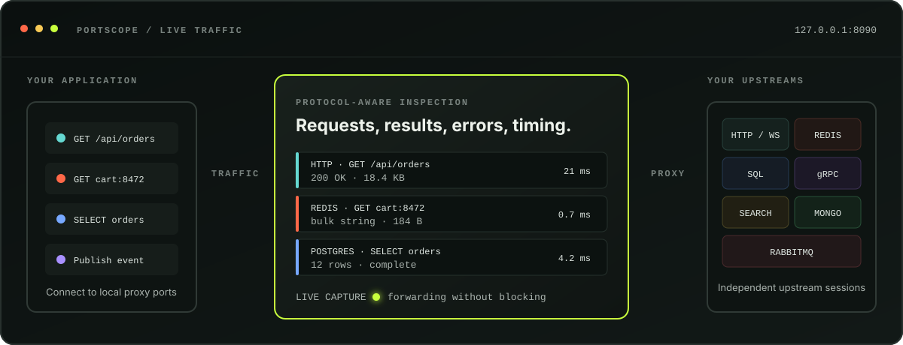

<div align="center">

# Portscope

**See what your application is really saying to its dependencies.**

Portscope is a local, protocol-aware inspection proxy for HTTP, WebSocket, Redis,
MySQL, PostgreSQL, Elasticsearch, OpenSearch, gRPC, MongoDB, and RabbitMQ.

[Get started](#get-started) · [Documentation](docs/README.md) · [Configuration](docs/configuration.md) · [Architecture](docs/architecture.md)

</div>



Point an application at a Portscope listener instead of its usual local service.
Portscope establishes the upstream connection, forwards the traffic, and shows
operations, payloads, results, errors, connection state, and timings live in the
browser. Configuration lives with the project; captured traffic does not.

## Why Portscope?

- **One view across the stack.** Follow an HTTP request, SQL query, cache lookup,
  RPC, search, message, or document operation without switching tools.
- **Protocol-aware inspection.** Portscope understands sessions, authentication,
  framing, pipelining, streaming, and errors instead of displaying an opaque TCP
  dump.
- **Safe local credentials.** Application-facing authentication and upstream
  authentication are independent for stateful protocols. Secrets can come from
  environment variables and are redacted from captures and the management API.
- **Project-native setup.** Commit one `portscope.json`; run one globally installed
  binary. The React interface and every adapter are embedded.

## Get started

Install a binary from [GitHub Releases](https://github.com/ErikBooij/portscope/releases)
or install from source with Go 1.26.6 or newer:

```bash
go install github.com/erikbooij/portscope@latest
```

Then initialize Portscope in a project:

```bash
cd your-project
portscope init
git add portscope.json .gitignore
portscope
```

Open <http://127.0.0.1:8090>, adjust the generated **Local API** upstream, and
point the application at its Portscope listen address. The first interaction
appears immediately. Portscope stores captures in the gitignored `.portscope/`
directory and writes UI configuration changes atomically to `portscope.json`.

For a guided HTTP and Redis walkthrough, installation alternatives, and Docker
notes, read [Getting started](docs/getting-started.md).

## Supported upstreams

| Upstream | Inspection highlights | Compatibility |
| --- | --- | --- |
| HTTP & WebSocket | HTTP/1.1, HTTP/2, h2c, RFC 6455 frames, streaming bodies, trailers, header policies | [Guide](docs/protocols.md#http-and-websocket) |
| Redis | RESP2/RESP3, pipelines, nested values, errors, push frames, independent auth, TLS | [Guide](docs/protocols.md#redis) |
| MySQL | MySQL 5.6 through current, queries, prepared statements, parameters, rows, multi-results | [Contract](docs/mysql-compatibility.md) |
| PostgreSQL | PostgreSQL 14–18, simple/extended queries, parameters, rows, pipelines, COPY | [Contract](docs/postgres-compatibility.md) |
| Elasticsearch & OpenSearch | Search-aware REST classification, JSON/NDJSON, hits, shards, bulk failures | [Contract](docs/search-compatibility.md) |
| gRPC | Native HTTP/2, all streaming modes, messages, status, deadlines, optional Protobuf JSON | [Contract](docs/grpc-compatibility.md) |
| MongoDB | MongoDB 6.0–8.3, OP_MSG, BSON/Extended JSON, cursors, transactions, SCRAM | [Contract](docs/mongodb-compatibility.md) |
| RabbitMQ | AMQP 0-9-1, channels, content, confirms, deliveries, acknowledgements, transactions | [Contract](docs/rabbitmq-compatibility.md) |

Portscope is intentionally a local development tool, not a production gateway.
Read [protocol support](docs/protocols.md) for configuration examples and
[known limitations](docs/limitations.md) before relying on a specific wire-level
feature.

## Documentation

- [Getting started](docs/getting-started.md) — install Portscope and capture your
  first HTTP or Redis interaction.
- [Project configuration](docs/configuration.md) — configuration discovery,
  repository-relative files, environment secrets, and CLI overrides.
- [Protocols and upstreams](docs/protocols.md) — choose and configure an adapter.
- [Architecture](docs/architecture.md) — adapter boundaries, observations,
  lifecycle, and persistence.
- [Security model](docs/security.md) — credential handling, TLS, redaction, and
  safe exposure.
- [Known limitations](docs/limitations.md) — the explicit edges of each adapter.
- [Development](docs/development.md) — build, test, matrix-test, and release the
  project.
- [Documentation index](docs/README.md) — every guide and compatibility contract.

The configuration format is also available as a bundled
[JSON Schema](portscope.schema.json).

## Contributing

Start with [CONTRIBUTING.md](CONTRIBUTING.md) and the relevant protocol
compatibility contract. Protocol changes should include bounded-parser tests,
credential-redaction coverage, and a real-server compatibility test where a
maintained container image is available.

## License

Portscope is available under the [Apache License 2.0](LICENSE).
